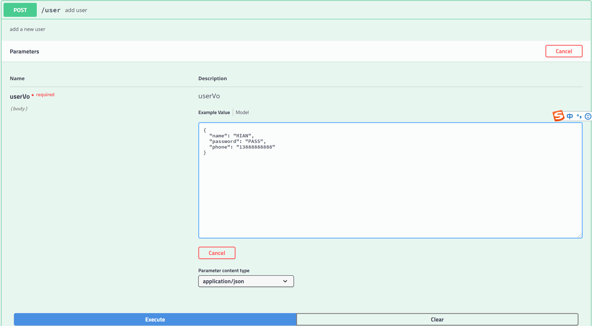
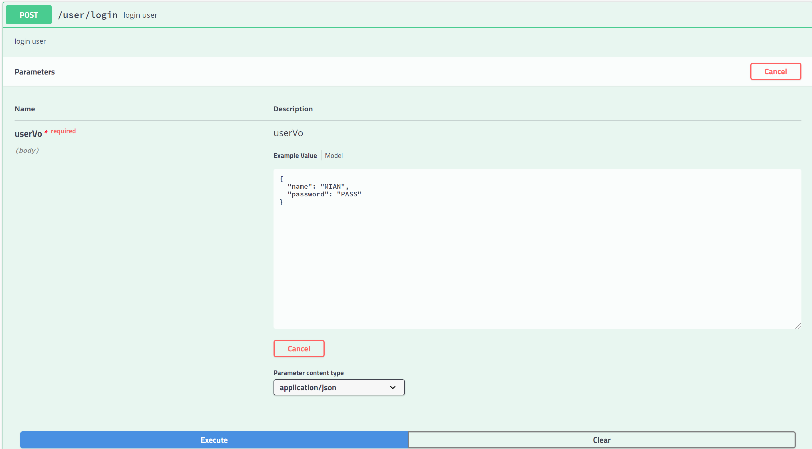
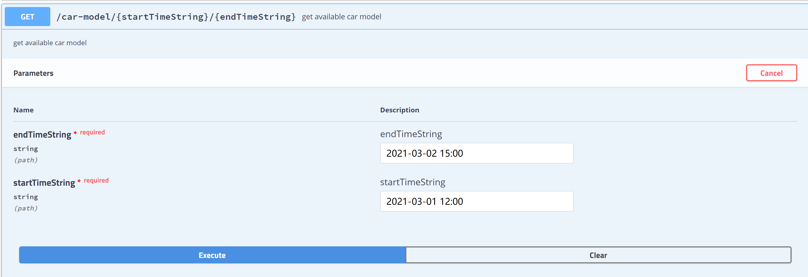
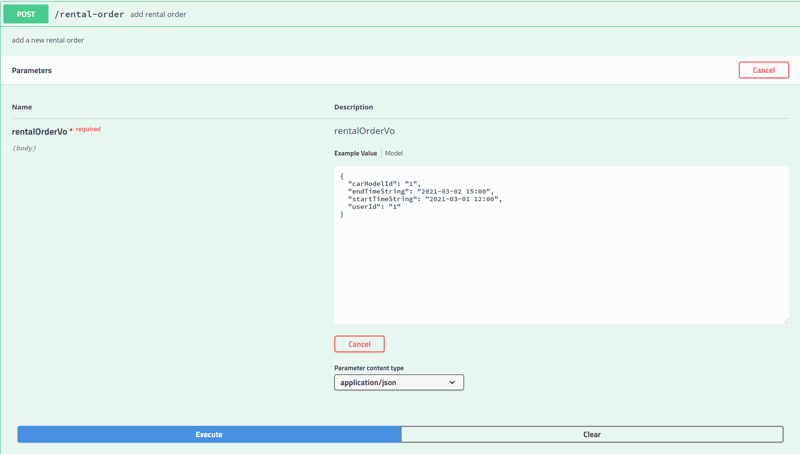

# Use Swagger to Simulate User Operation To Rent Car 
**`http://localhost:9527/swagger-ui.html`**

## 0. order process 

## 1. create new user
 
 Request:
 user controller: POST /user add user

 input sample:
 {
  "name": "MIAN",
  "password": "PASS",
  "phone": "13888888888"
}

Successful output sample: 
{"code":"2000","codeDescription":"success","timestamp":1613890515551,"data":"SUCCESS"}

## 2. User login
 
 Request:
 user controller: POST /user/login login user

 input sample:
{
  "name": "MIAN",
  "password": "PASS"
}

Successful output sample: 
{"code":"2000","codeDescription":"success","timestamp":1613890515551,"data":"SUCCESS"}

## 3. input time range to get available car model
 
 Request:
 car model controller: GET /car-model/{startTimeString}/{endTimeString} get available car model

 input sample(It must be on the hour):
    startTimeString:2021-03-01 12:00
    endTimeString:2021-03-02 15:00

Successful output sample: 
{
  "code": "2000",
  "codeDescription": "success",
  "timestamp": 1613893292236,
  "data": [
    {
      "id": "1",
      "name": "BMW 650",
      "pricePerHour": 5000,
      "inStock": 2,
      "createdAt": "2021-02-21T07:41:12.618+00:00"
    },
    {
      "id": "2",
      "name": "Toyota Camry",
      "pricePerHour": 1000,
      "inStock": 2,
      "createdAt": "2021-02-21T07:41:12.619+00:00"
    }
  ]
}

## 4. book a car rental order
 
 Request:
 rental order controller: POST /rental-order add rental order

 input sample:
{
  "carModelId": "1",
  "endTimeString": "2021-03-02 15:00",
  "startTimeString": "2021-03-01 12:00",
  "userId": "1"
}

Successful output sample: 
{
  "code": "2000",
  "codeDescription": "success",
  "timestamp": 1613895813307,
  "data": {
    "id": "1363403974861938689",
    "carId": "1",
    "userId": "1",
    "startTimeString": "2021-03-01 12:00",
    "endTimeString": "2021-03-02 15:00",
    "totalCost": 135000,
    "createdAt": null,
    "carModelId": "1",
    "car": {
      "id": "1",
      "licensePlate": "粤B11111",
      "carModelId": "1",
      "createdAt": "2021-02-21T08:22:41.620+00:00"
    }
  }
}

